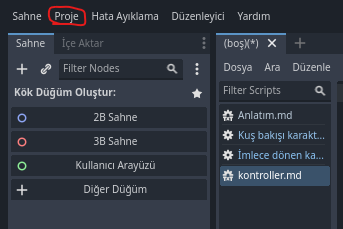

# Eğer kontrolleri değiştirmek istiyorsanız bunu okuyun
*Aksi takdirde, [CharacterBody2D.gd](CharacterBody2D.gd) aradığınız şey olmalı.*
## Kontroller
- İlk olarak, `Proje > Girdi Haritası` kısmına gidiyoruz.

- Bu kısma geldiğimizde ilk başta hiçbir şey göremeyebiliriz, resimde işaretlediğimiz `Show Built-in Actions` kısmını açıyoruz.

- Buraya gelen yeni şeylere baktığımızda, kodumuzda da bulunan `ui_up`, `ui_down`, `ui_left`, `ui_right` aksiyonlarını görebiliyoruz. Her birinin altındaysa klavyede ve oyun kollarında karşılık olacak tuşlar/joystickler berirlenmiş. 

*Eğer isterseniz kendi aksiyonlarınızı da oluşturabilirsiniz:*

- Yeni tuşlar atamak için resimde işaretlenen `+`'ya basın.

- Ardından açılan pencerede tercih ettiğiniz tuşu vs. seçin ve tamama basın.

**Artık atadığınız tuş ile karakterinizi kontrol edebileceksiniz.**